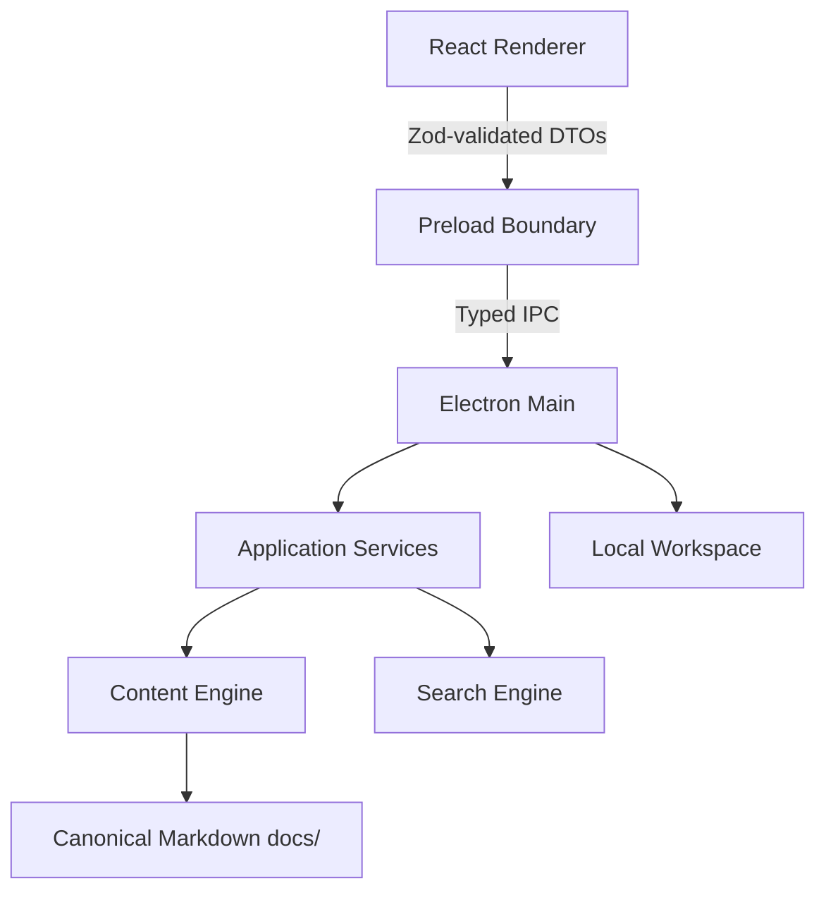

# Research Observatory Desktop

[`app-main`](https://github.com/PME26Elvis/llm-research-archive/tree/app-main) 是本 repository 的 Electron／TypeScript 桌面應用程式主線；`main` 則保留 canonical 研究內容、MkDocs 網站與 release dispatcher。Desktop 預設打包 `docs/` 文章，也能開啟使用者選擇的本機 Markdown workspace。

## 入口

- [Desktop source branch](https://github.com/PME26Elvis/llm-research-archive/tree/app-main)
- [Product specification](https://github.com/PME26Elvis/llm-research-archive/blob/app-main/project-docs/product/desktop-product-spec.md)
- [Architecture](https://github.com/PME26Elvis/llm-research-archive/tree/app-main/project-docs/architecture)
- [Acceptance matrix](https://github.com/PME26Elvis/llm-research-archive/blob/app-main/project-docs/quality/acceptance-matrix.md)
- [Release process](docs/desktop-release.md)
- [GitHub Releases](https://github.com/PME26Elvis/llm-research-archive/releases)

## 已實作能力

- Bundled archive 與 local workspace。
- 分類瀏覽、全文搜尋、Command Palette 與鍵盤操作。
- Markdown、Mermaid、syntax highlighting、footnotes 與安全 sanitization。
- 可調整三欄版面、導覽歷史、閱讀偏好與視窗狀態持久化。
- 原生檔案／資料夾選擇與四階段 Import Wizard。
- Deterministic import plans、typed IPC、main-process filesystem authority、atomic publication、conflict rollback 與明確來源刪除。
- Electron Forge Windows／Linux／macOS packaging、release manifest、packaged smoke、collision-free version selection 與可驗證的 draft／stable release pipeline。

## 架構概覽



主要原則：

- Renderer 不取得 unrestricted filesystem authority。
- 完整 import plans、absolute paths、staging 與 source-removal authority 留在 main process。
- Domain／content／search 邏輯保持 platform-neutral，Electron 僅是 adapter。
- `main/docs` 是文章唯一來源，經驗證後同步到 `app-main/docs`。

## 開發

```bash
git switch app-main
npm ci
npm run dev
```

完整驗證：

```bash
npm run verify
```

常用分項：

```bash
npm run format:check
npm run lint
npm run typecheck
npm run test
npm run test:security
npm run test:compatibility
npm run test:e2e
```

## 封裝

```bash
npm run make:windows
npm run make:linux
npm run make:macos:arm64
npm run make:macos:x64
npm run smoke:packaged
```

CI 會在原生 Windows、Linux、macOS Apple Silicon 與 macOS Intel runners 建立 packages、啟動實際封裝結果並上傳 release assets。macOS 目前輸出 ZIP；Windows 另有 Setup EXE，Linux 另有 DEB／RPM。

## 發布

Desktop Release 的入口放在 default branch，避免使用者需要先切換 branch 才能看到 workflow dispatcher：

1. Repository → **Actions** → **Desktop Release**。
2. `target_ref` 使用預設的 `app-main`，或指定 tag／commit。
3. `requested_version` 預設留白；workflow 會掃描 tags、drafts 與 published releases，自動使用 package version 或下一個可用 patch。
4. 初次驗證使用 `channel=prerelease`、`publish=false`，先建立 draft。
5. 檢查 Windows、Linux、macOS arm64／x64 assets。
6. 要發布同一 draft 時，在 `requested_version` 填入 draft 的精確版本、保持相同 `target_ref`，再設 `publish=true`。

不需要手動輸入 tag；tag 會以 `v<resolved-version>` 自動建立。留白會把 draft 也視為已占用，因此再次留白會建立下一個 patch。明確填入既有 draft version 時，preflight 會先確認 draft 指向相同 target SHA，再允許刷新或晉升；已發布版本與 Git tag 仍不可覆寫。

> macOS packages 使用 ad-hoc signing，尚未 Apple-notarized。第一次開啟時可能需要在 Finder 右鍵選擇 **Open**。

詳細欄位、自動版本規則與 artifact 行為請見 [`docs/desktop-release.md`](docs/desktop-release.md)。

## 內容同步

文章只在 `main/docs` 維護。當正式文章進入 `main`：

1. README catalog 由 generator 更新。
2. Automation checkout 最新 `app-main`。
3. `main/docs` 完整同步到 `app-main/docs`。
4. 在同步後的 Desktop tree 執行 `npm run verify`。
5. 驗證成功後更新並保留 `automation/sync-main-content`，再用 no-ff **一般 merge commit** 推進 `app-main`。
6. 若驗證期間 `app-main` 被其他工作更新，最後 push 會安全失敗，不會 force-overwrite 新進度。

因此 Desktop 不需要人工 cherry-pick 每篇新文章，也不會讓兩個 branch 各自演化出不同版本的文章。
