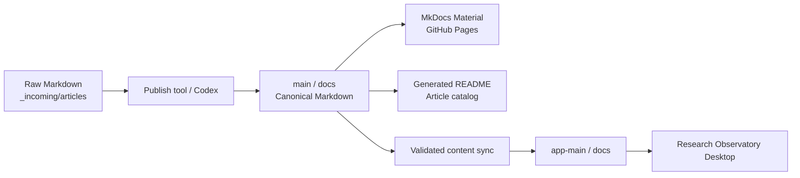

# LLM Research Archive

[](https://PME26Elvis.github.io/llm-research-archive/)
[](https://github.com/PME26Elvis/llm-research-archive/actions/workflows/deploy.yml)
[](https://github.com/PME26Elvis/llm-research-archive/actions/workflows/desktop-ci.yml)

一個以 **canonical Markdown** 為核心的繁體中文長文研究知識庫，同時提供可搜尋的 **MkDocs Material 網站**與離線優先的 **Research Observatory Desktop**。內容涵蓋 LLM／AI、算力與軟體工程、碳排與能源、Computer Science，以及可持續擴充的跨主題研究文章。

> `main` 是文章與網站的唯一內容來源；`app-main` 是 Electron 桌面應用程式主線。正式文章合併到 `main` 後，維護工作流會更新本文的文章目錄，驗證 Desktop，再以一般 merge 將 canonical `docs/` 同步到 `app-main`。

## 快速入口

| 入口 | 適合對象 | 說明 |
| --- | --- | --- |
| [瀏覽研究網站](https://PME26Elvis.github.io/llm-research-archive/) | 讀者 | 搜尋、分類、Tags、Timeline、深色模式與長文閱讀體驗。 |
| [目前所有文章](#目前所有文章) | 讀者／維護者 | 由正式 Markdown 自動產生的可點擊文章清單。 |
| [Desktop 獨立入口](DESKTOP.md) | 桌面使用者／開發者 | 功能、架構、開發、驗證、封裝與發布入口。 |
| [`app-main` branch](https://github.com/PME26Elvis/llm-research-archive/tree/app-main) | Desktop 開發者 | Electron／TypeScript monorepo 與完整桌面應用程式碼。 |
| [新文章上架 SOP](docs/article-publishing-workflow.md) | 維護者／Codex | 從 raw Markdown 到正式文章、README 與 Desktop 同步的完整流程。 |
| [Desktop Release](docs/desktop-release.md) | 發布維護者 | 從 `main` 手動 dispatch Windows／Linux Desktop release。 |

## 兩條產品主線

| Branch | 定位 | Source of truth | 自動化 |
| --- | --- | --- | --- |
| [`main`](https://github.com/PME26Elvis/llm-research-archive/tree/main) | 研究內容、MkDocs 網站、文章發布工具與 release dispatcher | `docs/` | README 文章目錄、MkDocs validation／deploy、Desktop 內容同步 |
| [`app-main`](https://github.com/PME26Elvis/llm-research-archive/tree/app-main) | Research Observatory Desktop | 應用程式碼與桌面規格；文章內容由 `main/docs` 同步 | TypeScript／security／compatibility／Electron E2E／Windows & Linux package smoke |



## 專案能力

### Research website

- **MkDocs Material 知識庫**：tabs／sections 導覽、instant navigation、搜尋標亮、深色模式、返回頂端與程式碼複製。
- **長文內容模型**：正式文章使用 `docs/<category>/<slug>/index.md`，以 YAML front matter 記錄日期與 Tags。
- **字數與閱讀時間**：`hooks/word_counts.py` 在 build 時產生文章統計與 [`docs/word-counts.md`](docs/word-counts.md)。
- **Tags、Timeline 與圖片閱讀**：整合 tags、blog 與 `mkdocs-glightbox`。
- **嚴格部署驗證**：GitHub Actions 在發布前執行文章目錄測試與 `mkdocs build --strict`。

### Research Observatory Desktop

- **離線優先閱讀器**：直接讀取 canonical Markdown，支援 bundled archive 與本機 workspace。
- **桌面級閱讀體驗**：搜尋、Command Palette、導覽歷史、可調整版面、偏好設定、Mermaid、語法標亮與 footnotes。
- **安全匯入流程**：四階段 Import Wizard、typed IPC、sanitized preview、stale-plan detection、atomic publication 與 rollback。
- **跨平台交付**：Electron Forge，Windows／Linux packages、packaged smoke 與可重現 release assets。

完整說明請見 [Desktop 獨立入口](DESKTOP.md)。

## 目前所有文章

<!-- article-catalog:start -->
> 此區塊由 [`tools/sync_readme_articles.py`](tools/sync_readme_articles.py) 從 `docs/` 自動產生；請勿手動維護清單。

**目前收錄 6 篇正式文章，分布於 4 個分類。**

### LLM / AI · 3

| 日期 | 文章 | Tags |
| --- | --- | --- |
| 2026-04-05 | [Agentic AI 在高度受限環境下的規劃與反思機制：2024–2026 細粒度深度分析](docs/llm/agentic-ai-constrained-environments-analysis-2024-2026/index.md) | `LLM` · `Agentic AI` |
| 2026-03-20 | [科技業龍頭為何認為「現在算力遠遠不夠」：原因、證據與三大主題深度分析](docs/llm/why-tech-giants-need-more-compute-report/index.md) | `LLM` |
| 2026-03-08 | [本地開源大型語言模型在實務軟體開發的真實效能與可部署價值研究報告](docs/llm/local-llm-dev-performance-report/index.md) | `LLM` · `本地` |

### Carbon / Energy · 1

| 日期 | 文章 | Tags |
| --- | --- | --- |
| 2026-06-02 | [臺灣再生能源裝置容量發展分析報告](docs/carbon/taiwan-renewable-energy-capacity-report/index.md) | `碳排放` · `再生能源` · `臺灣能源政策` · `電力系統` |

### Computer Science · 1

| 日期 | 文章 | Tags |
| --- | --- | --- |
| 2026-03-20 | [電腦科學超級樹：全域 CS 分層分類法與互動視覺化實作報告](docs/cs/cs-super-tree-report/index.md) | `Computer Science Ontology` · `Tech Stack Mapping` |

### Timeline · 1

| 日期 | 文章 | Tags |
| --- | --- | --- |
| 2026-03-05 | [Hello](docs/timeline/posts/hello.md) | `LLM` · `Notes` |

<!-- article-catalog:end -->

## 內容分類

| 分類 | 路徑 | 主題 |
| --- | --- | --- |
| LLM / AI | [`docs/llm/`](docs/llm/) | 模型、agentic AI、inference、算力、benchmark 與實務開發。 |
| Carbon / Energy | [`docs/carbon/`](docs/carbon/) | 碳排、電力、再生能源、供應結構與政策。 |
| Computer Science | [`docs/cs/`](docs/cs/) | 軟體工程、演算法、資料結構、分類法與技術棧。 |
| Timeline | [`docs/timeline/`](docs/timeline/) | 跨主題時間軸、短筆記與補充紀錄。 |
| Tags | [`docs/tags.md`](docs/tags.md) | 跨分類標籤索引。 |
| 字數總表 | [`docs/word-counts.md`](docs/word-counts.md) | 自動統計字數與預估閱讀時間。 |

## 新文章上架

### 最短流程

1. 把 raw Markdown 放入：

   ```text
   _incoming/articles/my-new-report.md
   ```

2. 執行：

   ```bash
   python tools/publish_article.py
   ```

3. 工具會建立 `docs/<category>/<slug>/index.md`、補上 metadata、清理已知生成標記、更新本 README 的文章目錄，並在成功後移除 raw input。

需要精確指定 metadata 時：

```bash
python tools/publish_article.py _incoming/articles/my-new-report.md \
  --category llm \
  --slug my-new-report \
  --tags "LLM,Agentic AI"
```

### 手動新增也會被接住

直接新增或修改 `docs/**` 也可以，不必手動維護文章清單。變更進入 `main` 後，[Content Maintenance](.github/workflows/content-maintenance.yml) 會：

1. 掃描所有具 `date` 與 H1 的正式文章。
2. 更新本 README 的 generated catalog。
3. 執行 generator unit tests。
4. 將 `main/docs` 視為 canonical content，覆蓋同步到 `app-main/docs`。
5. 在 `app-main` 的完整環境執行 `npm run verify`。
6. 驗證成功後建立同步 PR，並使用 **一般 merge commit** 合併；不採 squash／rebase。

詳細 metadata、附件、citation 清理、Codex 行為與檢查清單請見 [`docs/article-publishing-workflow.md`](docs/article-publishing-workflow.md)。

## 文章目錄生成

```bash
# 更新 README generated section
python tools/sync_readme_articles.py

# CI / review 時確認沒有過期
python tools/sync_readme_articles.py --check

# 只輸出生成結果
python tools/sync_readme_articles.py --stdout
```

生成器只會修改 `<!-- article-catalog:start -->` 與 `<!-- article-catalog:end -->` 之間的內容；其他 README 文案可正常人工維護。

## 專案結構

```text
.
├── README.md                         # Repository landing page + generated article catalog
├── DESKTOP.md                        # Desktop 獨立入口
├── docs/                             # Canonical Markdown；網站與 Desktop 共用
│   ├── index.md
│   ├── article-publishing-workflow.md
│   ├── desktop-release.md
│   ├── word-counts.md
│   ├── tags.md
│   ├── llm/ carbon/ cs/ health/
│   └── timeline/
├── hooks/word_counts.py              # MkDocs 字數／閱讀時間 hook
├── tools/
│   ├── publish_article.py            # Raw article → canonical article
│   ├── sync_readme_articles.py       # Canonical docs → README catalog
│   ├── test_sync_readme_articles.py  # Generator unit tests
│   ├── new_note.py
│   └── remove_citations.py
├── _incoming/articles/               # 待上架 raw Markdown
├── .github/workflows/
│   ├── deploy.yml                    # Website CI + GitHub Pages
│   ├── content-maintenance.yml       # README refresh + app-main content sync
│   └── desktop-release.yml           # Default-branch release dispatcher
├── mkdocs.yml
└── requirements.txt
```

Desktop monorepo 的 `apps/`、`packages/`、`project-docs/`、Electron Forge 與 Node tooling 位於 [`app-main`](https://github.com/PME26Elvis/llm-research-archive/tree/app-main)。

## 本機開發

### Website

```bash
python -m venv .venv
source .venv/bin/activate       # Windows PowerShell: .venv\Scripts\Activate.ps1
pip install -r requirements.txt
python -m unittest discover -s tools -p "test_*.py"
python tools/sync_readme_articles.py --check
mkdocs serve
mkdocs build --strict
```

### Desktop

```bash
git switch app-main
npm ci
npm run dev
npm run verify
```

平台封裝：

```bash
npm run make:windows
npm run make:linux
```

更多資訊請見 [`DESKTOP.md`](DESKTOP.md) 與 [`project-docs/`](https://github.com/PME26Elvis/llm-research-archive/tree/app-main/project-docs)。

## 自動化與部署

| Workflow | Branch / trigger | 責任 |
| --- | --- | --- |
| [`deploy.yml`](.github/workflows/deploy.yml) | PR to `main`、push to `main` | Generator tests、README generation validation、`mkdocs build --strict`；push 時部署 Pages。 |
| [`content-maintenance.yml`](.github/workflows/content-maintenance.yml) | `main` content changes、manual dispatch | 自動 commit README catalog；驗證並 merge `docs/` 到 `app-main`。 |
| [`desktop-ci.yml`](https://github.com/PME26Elvis/llm-research-archive/blob/app-main/.github/workflows/desktop-ci.yml) | `app-main` push / PR | Quality、E2E、Windows／Linux package smoke。 |
| [`desktop-release.yml`](.github/workflows/desktop-release.yml) | manual dispatch on `main` | 呼叫 `app-main` reusable release pipeline。 |

## 內容契約與維護原則

- `main/docs` 是 canonical content；不要把 `app-main/docs` 當成獨立編輯來源。
- 正式文章至少需要 YAML `date`、一個 H1 與建議的 `tags`。
- 文章路徑使用 `docs/<category>/<english-kebab-case-slug>/index.md`。
- 同篇文章的圖片與附件放在文章目錄的 `assets/`。
- 不手動編輯 generated article catalog；請修改文章 metadata 或執行 generator。
- 新分類需補 `docs/<category>/index.md` 與必要的 `.meta.yml`。
- 上架 AI 研究輸出時，清理 citation marker、entity wrapper、無資產 image placeholder 與不適合讀者的工具紀錄。
- 修改內容後至少執行 generator tests 與 `mkdocs build --strict`。
