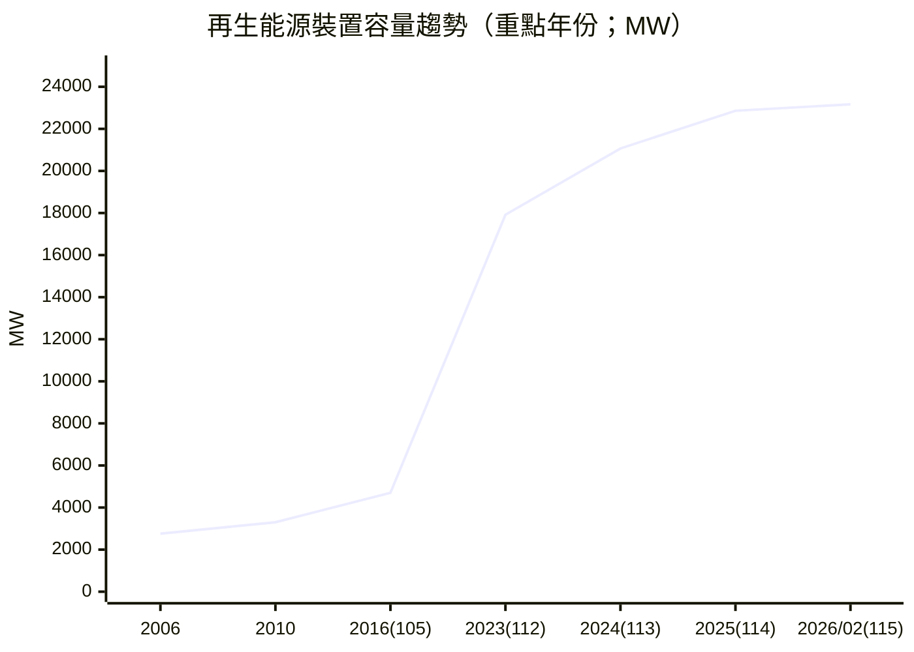
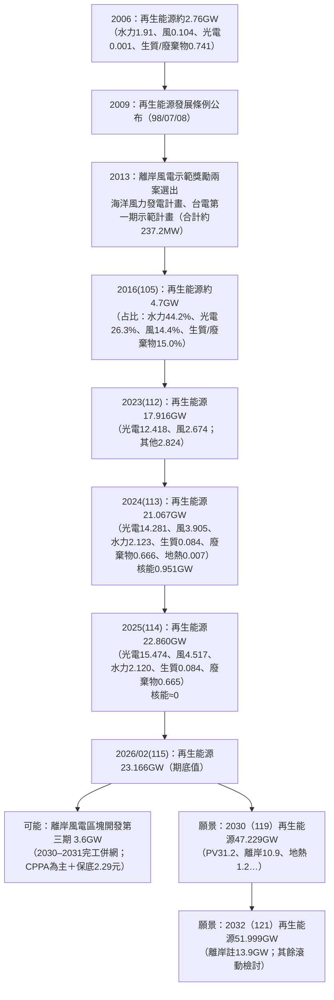

# 臺灣再生能源裝置容量發展分析報告

## Executive Summary

本報告以官方統計與政府核定文件為主，整理近二十年（以可取得之連續量化資料區間為準、並補充更早期官方引用資料）entity["country","臺灣","island in east asia"]再生能源（風力、太陽光電、生質能、廢棄物能、水力〔含小水力之併入統計口徑〕、地熱等）「裝置容量」（MW/GW）在過去、現在與未來的演進，並把「核能除役造成之容量缺口」與「再生能源/燃氣等替代策略」同框檢視。依entity["organization","經濟部能源署","taiwan energy administration"]年度報告與統計，113年底（2024年底）全國總發電裝置容量約66,716MW，其中再生能源21,067MW（約占裝置容量31.6%），其內太陽光電14,281MW、風力3,905MW、慣常水力2,123MW、生質能84MW、廢棄物能666MW、地熱7MW；同年底核能裝置容量為951MW。citeturn55view0turn56view1

若以最新「期底值」月資料觀察，114年底（2025年底）再生能源合計22,860MW；到115年2月（2026年2月）再生能源合計23,166MW，結構以太陽光電15,676MW與風力4,624MW為主，慣常水力約2,120MW，生質能與廢棄物能合計約745MW（其中生質能80MW、廢棄物能665MW）。citeturn31view0turn18view0

在「核能退場」面，entity["company","台灣電力公司","state-owned utility taiwan"]核電機組停止運轉時點呈階梯式：核一（2018、2019）、核二（2021、2023）、核三（2024、2025）。citeturn66view0其中特別關鍵的是核三2號機運轉執照於114年5月17日屆期，依規劃停機後自5月18日起進入除役期；核三1號機亦已於113年7月下旬進入除役期。citeturn63search0turn66view0從容量缺口角度看，2024年底核能尚有951MW，但2025年底統計表已不再列示核能容量（視為0），代表核能裝置容量在一年內減少約951MW；同期間再生能源由21,067MW增至22,860MW（+1,793MW），且燃氣裝置容量亦顯著增加，顯示「核能退場」的容量面替代主要由「再生能源擴增＋燃氣（及抽蓄/調度）支撐」共同完成，但能量（發電量）與尖峰可靠供應仍取決於容量因數與調度能力。citeturn56view1turn31view0turn63search4

展望未來，官方最新年度電力供需報告明確給出再生能源「容量目標」：以113年實績為基準，119年（2030）再生能源合計47.229GW、121年（2032）合計51.999GW；其中成長主力仍是太陽光電（2030目標31.2GW）與離岸風電（2030目標10.9GW，並註明將視R3.3招標內容滾動檢討）。citeturn57view2turn55view0同時，政府已公告離岸風電區塊開發第三期選商機制：分配容量3.6GW、以2030–2031年完工併網為期程，且以企業購售電合約（CPPA）為主、搭配每度2.29元保底收購價格以降低融資風險，屬「具明確制度與時程、但仍需完成選商與個案履約」的未來供給來源。citeturn63search2

## 執行重點與範圍

本報告聚焦「裝置容量（MW/GW）與年分」，並依需求區分為三段：早期（以2006–2010可量化年資料示範）、近年（2016起至最新月資料）、未來（2030/2032官方目標與離岸風電新一期制度）。其中，2001–2010年之各類再生能源裝置容量，引用立法機關文件所載、並明示其資料來源為當時主管機關能源統計手冊（例如2010年底再生能源裝置容量3,302.6MW，含水力1,977.5MW、生質能825.5MW〔含廢棄物能649.7MW〕、風力477.6MW、太陽光電22.0MW）。citeturn68view0

2016年（105年）起的中期基準，採能源署「裝置容量概況」所述：「再生能源由105年4.7百萬瓩增至113年21.1百萬瓩」，並用其揭露的結構占比（105年慣常水力44.2%、生質能及廢棄物15.0%、太陽光電26.3%、風力14.4%）作為105年底分項的估算依據；此區間分項屬「以官方總量×官方占比」推估，故在表格中以「估算」註記且允許四捨五入誤差。citeturn45search1

最新年度與近三年趨勢方面，本報告以113年度（2024年底）「年度電力供需報告之概述章」作為最新完整年度結構來源，並以經濟部統計系統（資料來源標示為能源署）提供之114年底（2025年底）與115年2月（2026年2月）「期底值」作為最新趨勢延伸點。citeturn56view1turn31view0

再生能源種類的口徑差異將明確標註：2001–2010年表格中「生質能」已明示含廢棄物能；2024年起官方年度報告將生質能與廢棄物能分列；而2025/2026之月資料表未另列地熱，故地熱在該表格欄位以「未指定（統計表未另列）」呈現。citeturn68view0turn56view1turn31view0小水力方面，能源署開放資料清單顯示確有「小水力_裝置容量」之縣市別年度資料集（與生質能、廢棄物、地熱、其他同表），但本報告採用之全國層級統計主要仍以「慣常水力」呈現，無法從全國彙總口徑中直接拆分小水力，故小水力在全國彙總表中多以「併入水力／未指定」處理。citeturn46view0

## 關鍵事實表格與容量趨勢

下表先以「具可核對之官方數值」呈現跨期對照（2006→2010→2016→2023→2024→2025→2026年2月），以滿足「至少過去20年或自可取得資料起」的可追溯性；其中2011–2015缺少同口徑可直接引用之年資料，依要求以「未指定」呈現。

### 年度容量快照表

| 年分（西元／民國） | 太陽光電 (MW) | 風力 (MW) | 水力（慣常） (MW) | 生質能+廢棄物能 (MW) | 地熱 (MW) | 再生能源合計 (MW) | 備註 |
|---|---:|---:|---:|---:|---:|---:|---|
| 2006 | 1.4 | 103.7 | 1,910 | 741.3 | 未指定 | 2,756.4 | 以2001–2010年序列中之2006年值；生質能欄位含廢棄物能 |
| 2010 | 22.0 | 477.6 | 1,977 | 825.5 | 未指定 | 3,302.6（約） | 2010年底再生能源3,302.6MW；生質能825.5MW含廢棄物能649.7MW |
| 2016／105 | 1,236（估算） | 677（估算） | 2,077（估算） | 705（估算） | 未指定 | 4,700 | 由105年再生能源4.7百萬瓩與各類占比換算（四捨五入） |
| 2023／112 | 12,418 | 2,674 | 未指定 | 未指定 | 未指定 | 17,916 | 「其他再生能源」合計2,824MW（含水力、生質能/廢棄物、地熱等） |
| 2024／113 | 14,281 | 3,905 | 2,123 | 750（=生質84+廢棄物666） | 7 | 21,067 | 年度報告明列各類再生能源容量 |
| 2025／114 | 15,474 | 4,517 | 2,120 | 749（=生質84+廢棄物665） | 未指定 | 22,860 | 期底值（年底）；地熱未另列 |
| 2026／115年2月 | 15,676 | 4,624 | 2,120 | 745（=生質80+廢棄物665） | 未指定 | 23,166 | 期底值（2月底）；反映近月變動 |

資料來源與註解：2006與2010年序列出自立法機關文件所載之「2001–2010國內發電裝置容量結構」圖表中再生能源分項（並引述主管機關統計手冊為來源）；2016（105）出自能源署「裝置容量概況」提供之總量與結構占比換算；2023年總量與分項（太陽光電、風力）引用研究機構對能源署統計的整理；2024年採年度電力供需報告圖表；2025與2026年2月採經濟部統計系統（資料來源標示能源署）之期底值。citeturn68view0turn45search1turn45search19turn56view1turn31view0

### 容量趨勢圖

圖中2006–2010源自官方統計被引用的歷史序列；2016（105）為能源署總量與占比之換算估值；2023–2026為近年官方統計／年度報告可核對數值。citeturn68view0turn45search1turn45search19turn56view1turn31view0

### 最新年度與近三年重點變化

以近三年（2023→2024→2025→2026年2月）來看，新增量主要集中於太陽光電與風力：2024年底太陽光電14,281MW、風力3,905MW；2025年底太陽光電15,474MW（年增+1,193MW）、風力4,517MW（年增+612MW）；到2026年2月太陽光電15,676MW、風力4,624MW，顯示2026年初仍延續「光電與風電雙主軸」的容量擴增結構。citeturn56view1turn31view0

## 歷史里程碑清單

本節以「政策/制度里程碑→類型容量變化→與核能/火力替代關係」方式排列，並優先採官方或立法機關文件；若為產業報告，將在來源中明示並在結論處提示不確定性。

- 2007：行政院產業科技策略會議（SRB）研訂短中長期再生能源推廣目標，2010年目標包含風力98萬瓩、太陽光電3.1萬瓩、生質能74.1萬瓩、水力215.8萬瓩（合計391萬瓩）。此階段反映早期政策將風力、太陽光電、生質能列為主要推動項目。citeturn68view0

- 2009：再生能源發展條例公布（民國98年07月08日），確立推廣與主管機關架構；其後並於2019年修法強化推動機制。citeturn67search4turn67search2

- 2006→2010：早期裝置容量以水力與生質能（含廢棄物能）為主，風力與太陽光電仍處起步期；2010年底再生能源約3.3GW，其中水力約2.0GW、風力477.6MW、太陽光電22MW。此階段可視為「再生能源以穩定型資源為主、間歇型占比仍低」的結構。citeturn68view0

- 2012→2013：離岸風電制度與早期專案萌芽。經濟部於2012年成立「風力發電單一服務窗口」推動計畫辦公室並公告「離岸風力發電示範獎勵辦法」，2013年選出示範獎勵兩案：「海洋風力發電計畫」與「台電公司第一期示範計畫」，合計約237.2MW，且分別於2019與2021年商轉。此為「離岸風電由示範走向商轉」的重要節點。citeturn69view0

- 2016（105）：再生能源總裝置容量約4.7GW，且結構仍以慣常水力占比最高（約44%）；但太陽光電占比約26.3%、風力約14.4%，顯示後續擴張主力已逐漸轉向光電與風電。citeturn45search1

- 2018→2019：離岸風電進入「潛力場址」階段。產業報告指出，2018年經濟部公告第二階段作業要點並選出共14個離岸風場、合計5.5GW，原規劃2025年前完成；2019年在海洋示範風場商轉啟動典禮上，政府宣布以每年釋出1.5GW、2035年再增15GW之方向。此反映離岸風電由示範轉向規模化供給的政策節奏。citeturn69view0

- 2019：立法院三讀通過修正再生能源發展條例（108年4月12日），包含用電大戶義務、再生能源業者可在政府躉購與自由市場間選擇等制度調整，強化市場面與需求面牽引。citeturn67search2

- 2023（112）：再生能源總裝置容量達17,916MW，其中太陽光電12,418MW、風電2,674MW；同年政府報告亦指出112年底離岸風電裝置容量達176.3萬瓩（1,763MW），太陽光電「已可滿足白天尖峰6小時用電需求」，系統調度重心轉向夜尖峰調度。citeturn45search19turn45search4

- 2024（113）：再生能源裝置容量累計達21,067MW；其中太陽光電14,281MW、風力3,905MW等；同年底全國裝置容量結構顯示再生能源占比已達31.6%。此外，年度報告亦指出為因應再生能源間歇性，需搭配可快速起停之燃氣機組、電池儲能與抽蓄水力等調節方式，將再生能源整合與供電穩定並列為治理核心。citeturn56view1turn55view0

- 2024→2025：核能除役造成容量缺口並由其他電源補上。核三1號機於113年7月下旬停止運轉進入除役期，核三2號機運轉執照於114年5月17日屆期並預定翌日進入除役期；按年底裝置容量統計，2024年底核能仍為951MW，但2025年底已不再列示核能容量。經濟部並對外說明，核三2號機依法除役後，已規劃今年將有近500萬瓩（約4.8GW）大型燃氣機組上線，並搭配再生能源、抽蓄水力與負載管理確保供電。citeturn63search0turn66view0turn56view1turn31view0turn63search4

## 未來分支清單

本節將未來容量發展明確分為三類：  
「確定執行」＝已核定且具明確期程/預算或已依法定時程推動；  
「可能執行」＝已公告制度與時程或已進入選商/規劃，但仍受標案、融資、環評、併網等不確定性影響；  
「願景」＝政策目標（容量或占比）與宣示，通常需多項專案疊加才能達成。

### 確定執行

再生能源的「確定執行」多以制度與治理工具呈現，特別是離岸風電的政策推動與履約管理。行政院核定之「再生能源加速-離岸風電減碳旗艦行動計畫（核定本）」載明計畫期程為115–119年（2026–2030），主辦機關為經濟部、主要執行機關為能源署，並透過跨部會合作推動風場建置履約管理、選商制度研析、社會溝通與運維技術研發等工作（本計畫屬政策與能力建構，未在文件中直接給出對應新增容量，故容量欄位標註未指定）。citeturn64view0

### 可能執行

離岸風電區塊開發第三期（官方公告於2026年3月）屬「制度已公告、但仍待選商與個案履約」的典型。其分配容量3.6GW，目標2030–2031年完工併網；綠電交易以CPPA為主，並新增每度2.29元保底收購價格以降低融資風險，另設容量擴充機制（獲配廠商最高可擴充原獲配容量50%）。不確定性主要落在：選商結果、融資條件、供應鏈與施工船舶/工期、環評與海域協調、以及併網點與電網強化工程等。citeturn63search2turn64view0

### 願景

能源署年度電力供需報告（概述章）提供「再生能源未來目標」表，以113年（2024）實績為基準，提出119年（2030）與121年（2032）各類再生能源裝置容量目標：太陽光電分別31.2GW與32.7GW；離岸風電10.9GW與（註）13.9GW；陸域風電0.979GW；地熱1.2GW與1.4GW；生質能及廢棄物0.810GW與0.840GW；水力2.140GW與2.180GW；合計47.229GW與51.999GW，並註明離岸風力目標將視R3.3招標內容滾動檢討。citeturn57view2turn55view0

同時，經濟部對外說明再生能源發電占比達成節點：預估2026年11月起再生能源發電占比可達20%，其後逐步提高，預估2030年約可達30%。這是「發電占比」層級的願景/路徑點，與「裝置容量」目標需共同對照，但兩者不必然等比（受容量因數、系統調度與需求面變動影響）。citeturn63search3turn55view0

### 未來分支對照表

| 類別 | 項目（政策/計畫/目標） | 估計完工/目標年 | 容量（MW/GW） | 主推動單位 | 是否用於替代核能/火力缺口 | 不確定性說明 |
|---|---|---:|---:|---|---|---|
| 確定執行 | 再生能源加速－離岸風電減碳旗艦行動計畫（核定本） | 2026–2030（115–119） | 未指定 | 經濟部/能源署（跨部會） | 間接：強化風電建置與併網治理，支撐減煤/替代 | 容量非此文件主輸出；屬制度與能力建構 |
| 可能執行 | 離岸風電區塊開發第三期（選商機制公告） | 2030–2031 | 3.6GW（可擴充至+50%） | 經濟部/能源署 | 是：新增無碳電源，支撐減煤與核退後供給 | 選商/融資/環評/併網/供應鏈與工期 |
| 願景 | 2030再生能源容量目標（表3-1） | 2030 | 47.229GW（含PV31.2、離岸10.9、地熱1.2等） | 能源署（年度供需規劃） | 是：對應「二次能源轉型」與減煤減碳路徑 | 需多項專案叠加；離岸目標註明可滾動檢討 |
| 願景 | 2032再生能源容量目標（表3-1） | 2032 | 51.999GW（離岸註13.9GW） | 能源署（年度供需規劃） | 是：中期去碳電力供給支柱 | 地熱與離岸擴張不確定性最高 |

表格來源：行政院核定之離岸風電減碳旗艦行動計畫、經濟部離岸風電區塊開發第三期公告、能源署年度供需報告表3-1。citeturn64view0turn63search2turn57view2

## Mermaid 時間線與說明

說明：此圖以容量數據可核對年份作主軸（2006、2016、2023–2026），並將離岸風電制度與未來目標以分支呈現。2006年容量來自政府統計被立法文件引用的歷史序列；2013年示範案容量來自產業報告彙整；2016年為能源署公告總量與占比換算；2024年為年度電力供需報告；2025與2026/02為期底值統計；未來分支取自經濟部離岸風電第三期公告與能源署表3-1目標。citeturn68view0turn69view0turn45search1turn56view1turn31view0turn63search2turn57view2

## 結論與政策風險評估

從長期趨勢看，再生能源裝置容量已由2006年約2.76GW成長至2025年底22.86GW、2026年2月23.17GW，二十年內增加約20GW以上；成長結構由早期以水力與生質/廢棄物為主，逐步轉為「太陽光電＋風力」主導，且在2024年底全國裝置容量結構中，再生能源已達31.6%的量級。citeturn68view0turn56view1turn31view0turn45search1

核能退場的替代關係需要以「容量」與「可用供電能力」分別評估。就容量而言，2024年底仍有951MW核能裝置容量，而2025年底統計已不再列示核能，顯示核能容量缺口約951MW；同期間再生能源容量淨增約1,793MW，且燃氣裝置容量亦上升，並有政府所述近4.8GW新燃氣機組陸續上線作為接棒供給。就「是否完全替代」而言，太陽光電與風電為間歇電源，對夜尖峰之貢獻需透過水力/抽蓄、燃氣、儲能、需求面管理等共同實現，官方年度報告亦將「間歇性調節」列為供電策略核心。citeturn56view1turn31view0turn63search4turn55view0

展望2030（119）再生能源容量47.229GW的官方目標，意味著自2024年21.067GW起，六年內需再增加約26GW以上的再生能源裝置容量；其中太陽光電需由14.3GW推升至31.2GW（+16.9GW），離岸風電由3.0GW推升至10.9GW（+7.9GW），地熱由7MW推升至1.2GW（+約1.19GW）。這代表政策風險將高度集中在三條主線：其一，光電土地/屋頂資源、併網容量與地方治理能否支撐年均多GW級擴張；其二，離岸風電在「選商—融資—供應鏈—施工—併網」全鏈條中的履約風險（第三期雖已公告3.6GW與2030–2031期程，但仍需完成選商並承擔海事與電網風險）；其三，地熱由MW級擴張至GW級的資源探勘、法規許可與資本投入不確定性極高，雖已進入官方目標表，但達標難度顯著高於光電/風電。citeturn57view2turn63search2turn55view0turn64view0

最後，本報告亦建議讀者在解讀「裝置容量占比」與「發電占比」時保持區分：經濟部對外說明再生能源發電占比可於2026年11月達20%、2030約30%，屬發電量/占比路徑；而容量目標（GW）一方面要匹配需求成長與機組除役，同時也需匹配電網韌性、儲能與尖離峰調度的系統工程，否則即便容量達標，仍可能面臨「白天富餘、夜間吃緊」的結構性挑戰。citeturn63search3turn45search4turn55view0turn31view0
