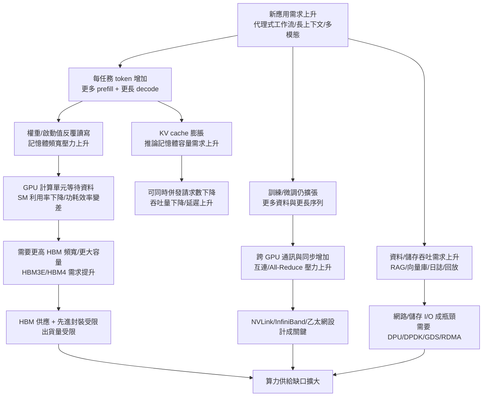

# 科技業龍頭為何認為「現在算力遠遠不夠」：原因、證據與三大主題深度分析

## 執行摘要

近兩年「算力不夠」不再只是訓練更大模型的口號，而是一個由**需求端（token 與工作流爆炸）**與**供給端（GPU 供應鏈、HBM、封裝、電力/機房）**共同驅動的結構性落差。以entity["company","輝達（NVIDIA）","gpu company, us"]為例，其 CEO 在 2026 年公開把 AI 基礎設施需求上修到 2027 年至少 1 兆美元，並明確表示仍可能「供不應求」，同時策略重心也轉向更長期、規模更大的 **inference（推論）**需求。

需求端的核心變化是：AI 從「一次回答」走向「多步驟代理（agentic）/工具使用/長上下文」，單次請求背後隱含的模型呼叫次數、token 量、KV cache（推論記憶體）與資料搬移都會放大；而且在高品質需求下，Chain-of-Thought、重採樣（pass@k）、多模型協作等做法會把「每個任務的計算量」成倍提高，形成類似 Jevons Paradox 的「效率提升反而帶動總量更大」效應。

供給端則不僅是「買不到 GPU」，還包括：先進封裝（如 CoWoS 類）與 HBM 供應緊張限制了可出貨的加速卡數量；HBM（高頻寬記憶體）在 2024–2025 年已出現「售罄」與長期高成長預期；即使 GPU 到貨，機房仍可能受制於電力與併網時程，導致硬體閒置。

在硬體架構層面，AI 伺服器的「記憶體量產」並非單純追求容量，而是為了降低 **(1) 訓練：記憶體容量/頻寬與跨 GPU 通訊**、**(2) 推論：權重讀取與 KV cache 的記憶體頻寬/容量**、以及 **(3) 資料管線：網路/儲存 I/O** 這三類瓶頸。大量實證指出推論往往呈現「記憶體頻寬受限」，而新一代 HBM（例如 HBM3E）在相同平台上能帶來顯著吞吐提升與更好的功耗/成本結果。

最後，LLM 跑分（benchmarks）在 2024–2026 年呈現兩個矛盾趨勢：一方面仍是投資與採購的共同語言（MMLU、HumanEval 等），另一方面其外推性與可信度被更多研究挑戰，原因包括：prompt 敏感性、測試資料外洩（contamination）、以及「為跑分而微調/選模」造成的 leaderboard overfitting。程式碼類評測尤為明顯：研究指出 HumanEval/MBPP 題目在公開 GitHub 上大量出現，並有定量證據顯示資料集已滲入常用訓練語料（例如 The Pile、The Stack），使得分數不再等價於「真正未見資料的泛化能力」。

## 關鍵結論

算力不足的本質是「端到端系統吞吐不足」，不是單一晶片算力（TFLOPS/TOPS）不足：更常見的是記憶體頻寬、互連、網路/儲存 I/O、電力/冷卻共同形成瓶頸，導致 GPU 利用率被壓低。

推論需求的成長機制與訓練不同：推論會隨「用戶數 × 每次請求 token（含長上下文）× 代理式多輪呼叫」快速放大；且解碼（decode）階段常呈記憶體頻寬受限，使「HBM 帶寬/容量」成為直接決定 tokens/sec 的關鍵硬體指標。

HBM 與先進封裝是供給端最硬的瓶頸之一：HBM 曾出現年度產能售罄與「中長期年增約 60%」的需求預期；而加速卡出貨也受先進封裝產能分配影響。

電力/機房成為「算力落地」的實體限制：即使大型雲端已採購 GPU，也可能因缺電與機房建置/併網限制導致設備閒置；同時全球資料中心用電在 2030 年可能快速攀升，AI 被視為重要驅動因素之一。

跑分仍有價值，但需「分層解讀」：知識型多選（MMLU）可能面臨飽和與 prompt/評分敏感；程式生成（HumanEval）容易被 pass@k、資料外洩與重複題庫影響；新一代 benchmark（如 MMLU-Pro、LiveCodeBench）正是為了解決「飽和、prompt 敏感、污染」等問題而生。

## 證據摘要與判讀框架

「算力不夠」在產業語境中通常同時指向三層：晶片與系統的可用算力（GPU 數與單卡效能）、支撐算力的記憶體/互連效率（讓 GPU 不空轉）、以及讓算力可持續擴張的基礎設施（電力、冷卻、機房）。當entity["company","OpenAI","ai lab, us"] CEO 公開表示「算力不足正在拖延產品推出」，同一期間entity["company","Microsoft","software company, us"] CEO 又指出 GPU 可能因缺電而「插不上去」，這反映的其實是「算力供給鏈」與「算力落地」的雙重瓶頸。

供給鏈層面，AI 加速卡出貨往往受限於先進封裝與 HBM。TrendForce 指出 CoWoS 類封裝需求與供給緊張，並促使台灣供應鏈擴產。而 HBM 方面，entity["company","SK 海力士","memory company, kr"]在 2024 年便表示當年 HBM 已售罄、2025 年也「幾乎售罄」，並預期中長期需求年增約 60%，凸顯「記憶體不是配角，而是 AI 算力的硬約束」。

基礎設施層面，entity["organization","國際能源總署（IEA）","energy agency"]的情境估算指出全球資料中心用電可能在 2030 年接近翻倍至約 945 TWh，且 2024–2030 的年成長率顯著高於其他用電部門；AI 被多份分析視為其中重要推力之一。這提供了「為何算力永遠不夠」的物理上限視角：即使晶片供給改善，電力/冷卻仍是可擴張性上限。

下圖用「端到端因果鏈」描述：為何某些應用（代理、長上下文、多模態）會把瓶頸推向記憶體、互連與 I/O，最後回到「算力不足」的體感。

此流程對應到實際硬體規格與系統設計：例如 H100 透過 HBM3 提供 TB/s 等級記憶體頻寬、並用 NVLink 提升多 GPU 通訊帶寬；同時產業也開始以更系統化方式處理儲存/網路瓶頸（例如以 DPU 與加速網路/儲存架構服務代理式 AI）。

image_group{"layout":"carousel","aspect_ratio":"16:9","query":["NVIDIA H100 SXM5 module HBM3 memory", "HGX H100 server board NVLink", "HBM3E memory stack 3D DRAM", "NVLink Switch system rack scale AI"],"num_per_query":1}

## 應用場景如何推升算力需求

### 推論端的「token 爆炸」來源

代理式 AI（Agentic AI）與工具使用工作流：從請你「回答」變成請你「完成任務」（例如讀文件、搜尋、呼叫 API、寫/跑程式、反覆修正），往往需要多輪 prefill/decode 循環，token 量可按「步驟數」倍增。輝達在 2026 年針對推論市場的描述顯示：推論需求正成為其最大成長敘事之一，並且在推論內部已出現「prefill 與 decode 分責」的硬體/系統分工（例如不同晶片負責不同階段），本質上就是因為推論負載形態與瓶頸正在細分。

長上下文（long context）與「記憶型推論」：長上下文會直接推高 prefill 的計算量與 KV cache 的容量需求。代理式應用（例如要持續讀取大量檔案、長時間對話、或將大量檢索文件塞入 prompt）會讓「上下文常駐」成為成本中心。實務上這會反映為：可同時服務的併發數下降、延遲上升，進而要求更大的 GPU 記憶體與更高頻寬。

高品質推論（reasoning / CoT / 多次採樣）：為了提升正確率或一致性，常見做法包含 Chain-of-Thought、self-consistency（多次採樣投票）、或多代理互評。以評測研究為例，MMLU-Pro 報告指出在更偏推理的題目上，使用 CoT 可能顯著提升表現，這在產品上常被映射為「用更多 token 換品質」。該趨勢會對算力形成「品質驅動的需求擴張」，其量級高度不確定，取決於產品是否把高品質模式開為預設、以及是否能用蒸餾/小模型路由降低昂貴路徑的使用率。

量級不確定性（推論端）：建議用「每個任務的有效 token（含隱式呼叫）」作為核心度量，並以 3 個情境做規劃：  
低：主要是短問答/短摘要（token/請求穩定，併發主導）。  
中：RAG + 長文件（prefill 成本抬升，KV cache 壓力主導）。  
高：代理式多步驟 + 高品質推理（多輪呼叫，token 可能呈 10× 以上放大，且高峰期更尖銳）。

### 訓練端的「固定成本」與「周邊成本」同時上升

「更大」與「更久」仍在發生：經典 scaling laws 工作指出模型表現可隨模型、資料、計算量按冪律改善；而 compute-optimal 訓練研究（Chinchilla）指出在固定算力預算下，模型大小與訓練 token 應共同擴張，暗示若要持續提升品質，**訓練總 token 與計算量仍會上升**。這讓訓練算力需求具「長期黏性」：即使推論成為主敘事，訓練仍需要大量 GPU 時間去維持模型代際。

多模態與新資料形態：多模態（圖像/音訊/影片）與更長序列長度會把訓練中的注意力計算推向 I/O 瓶頸。以 FlashAttention 為例，其核心貢獻正是把注意力設計成「IO-aware」，減少 HBM ↔ 片上 SRAM 的讀寫，顯示在訓練中「記憶體搬移」常是比 FLOPs 更硬的瓶頸。

訓練管線的周邊成本：越大的訓練作業越依賴高吞吐資料管線（儲存、網路、前處理）。在代理式與長上下文時代，資料不只是訓練資料集，也包含推論端回饋（log、偏好資料、合成資料）、以及大量向量索引/文件庫。這使得「訓練/推論共用的資料基礎設施」成為算力擴張的必要條件。

### 需求成長的時間軸與可規劃假設

短期（0–18 個月）：企業導入生成式 AI（客服、內部知識庫、文件處理、程式輔助）將推高推論吞吐；瓶頸多落在 GPU 記憶體容量/頻寬與服務化工程（批次、排程、KV cache）。

中期（18–48 個月）：代理式工作流更深度嵌入流程，推論負載由「單輪互動」轉為「多輪任務」，token/任務暴增；同時大量用例更依賴即時資料與長上下文，帶動網路/儲存 I/O 架構升級。

長期（4–8 年）：受更大瓶頸制約（電力、併網、土地、水、供應鏈），形成「算力供應不是你想擴就能擴」的現實。資料中心用電的成長預估提供了這個長期約束的量化背景。

## AI 伺服器記憶體量產的目的與效益

### 先定義：AI 伺服器的「記憶體」是三層

加速器本地記憶體（HBM）：提供 TB/s 等級帶寬，是訓練與推論的核心工作集所在（權重、啟動值、KV cache）。例如 H100 的規格即顯示其 HBM 帶寬達 TB/s 等級。

主機記憶體（DDR5 RDIMM 等）：支撐資料管線、CPU offload、以及部分訓練/推論的中間態；在某些策略（如把部分訓練狀態 offload 到 CPU）下，主機記憶體容量會決定可否避免 OOM。

儲存與網路 I/O（NVMe、RDMA、DPU/SmartNIC）：承接 RAG、大規模資料讀取、檢索索引與日誌回放，並直接影響 GPU 是否「等資料」。

「記憶體量產」的目的，實務上就是在這三層同時擴張供給並降低成本，使系統可以在更多工作負載下維持高利用率。

### 訓練：容量、頻寬與互連，決定可擴張性與單位成本

容量：訓練需要存放權重、梯度、優化器狀態與啟動值，容量不足會迫使使用模型並行/ZeRO/offload 等技巧，增加通訊與工程複雜度。訓練用 HBM3E 的一個直接價值是「單顆 placement 容量提升」，讓單卡可承載更大的工作集或更高精度，減少 offload 與跨卡切分需求。

頻寬：訓練不只需要算得快，也要餵得快。測試數據顯示，僅提高 HBM 時脈（1593 → 2619 MHz）就能在 Llama 7B fine-tuning 帶來 15% 訓練效能提升，並伴隨 GPU/記憶體利用率變化與功耗上升，反映該工作負載對記憶體子系統敏感。這也說明為何 HBM 的頻寬/功耗曲線會是下一代訓練成本的關鍵。

互連（NVLink vs PCIe）：分散式訓練的大頭成本常落在 all-reduce/參數同步。NVIDIA 技術資料指出 H100 的第四代 NVLink 總帶寬達 900 GB/s，並且可透過 NVLink Switch System 把 GPU-to-GPU 通訊擴展到多節點、最多達 256 GPU、提供 57.6 TB/s all-to-all 帶寬等級的互連能力。這類互連配置的目的，是讓「通訊速度跟得上算力擴張」，否則 GPU 會在同步點上空轉，直接拉高每 step 成本。

### 推論：權重讀取 + KV cache 讓「HBM 帶寬/容量」變成 tokens/sec 的上限

推論常是記憶體頻寬受限：NVIDIA 的推論最佳化文件直接指出模型執行常呈「memory-bandwidth bound（尤其權重）」；另有研究從系統角度說明自迴歸解碼每產生一個 token 都需要反覆讀取權重並讀寫 KV cache，若記憶體無法供應，吞吐就會停滯。這也是「算力不夠」在推論端最常見的真相：不是算不動，而是資料搬不動。

KV cache 的容量膨脹：高吞吐服務需要 batching，但 batching 受限於 KV cache 的記憶體占用與碎片化。vLLM 的 PagedAttention 研究指出：在相同延遲下，其透過更高效率的 KV cache 管理可把吞吐提升 2–4 倍，且長序列/大模型時效果更明顯，直接證明「記憶體管理方式」會影響可用吞吐上限。

產業測試：HBM3E 對推論吞吐的可觀影響。在 HGX H100（HBM3）與 HGX H200（HBM3E）對比的技術簡報中，報告指出：HBM3E 的更高帶寬與容量可使 Llama 2 70B 推論最高達 1.8× 效能提升，並能支援約 2.5× 的 batch size（更多並發請求）；同時也討論了功耗與 TCO 的改善。輝達在 MLPerf 報告亦明確指出 H200 相對 H100 的記憶體容量與帶寬提升，特別有利「memory-sensitive」用例。

### I/O 瓶頸：不只在 GPU 內，也在「網路/儲存 ↔ GPU」之間

當推論進入代理式、長上下文與大量檢索時，瓶頸會外溢到儲存與網路：例如針對 agentic AI 的儲存參考架構（以 DPU/加速網路/加速儲存為核心）被提出，目的就是降低資料存取造成的 GPU underutilization。

這也連結到 DPDK/RDMA：Data Plane Development Kit（DPDK）被定義為一個用戶態高速封包處理框架，透過 kernel bypass 等手段降低網路處理開銷；NVIDIA 亦提供與 DPDK 相關的 PMD 與低延遲封包處理描述。而在更「把資料直接送進 GPU 記憶體」的路徑上，GPUDirect RDMA 的目標就是建立 GPU Memory 與網卡之間的 P2P 通道，降低 CPU 參與與延遲。這些技術在推論服務化（尤其多節點擴展、prefill/decode 分離、外部資料攝取）會越來越關鍵。

### 「量產」的供應鏈理由：HBM 標準演進與實際短缺共同驅動

標準演進：entity["organization","JEDEC","memory standards body"]在 HBM4 的標準中被報導可達 8 Gb/s、2048-bit 介面、總帶寬可至 2 TB/s，且通道數由 HBM3 的 16 增至 32，目標就是讓 AI/HPC 面對更高並行記憶體存取時有更高吞吐與效率。

供應短缺：SK 海力士的 HBM 售罄與高成長預期、以及記憶體產能擴張需要多年（晶圓、封測、供應鏈）的現實，解釋了「為何產業要談記憶體量產」：它其實是要解除 AI 算力的上游瓶頸。

## LLM 跑分現況與可靠度

### 常用 benchmarks 與測試型態概覽

GLUE / SuperGLUE：多任務 NLU（分類、推論、相似度等）集合，適合觀察通用語言理解，但作者也指出 GLUE 很快達到接近非專家人類水準，促成 SuperGLUE 的推出，反映 benchmark 會「被做滿」而失去區辨力。

MMLU：以 57 科目多選題測知識與解題能力，成為事實上的通用評測語言。  
但 MMLU 的飽和與 prompt 敏感性也引發後續改進（MMLU-Pro）：MMLU-Pro 增加選項數、提升推理題比例、並報告在 24 種 prompt 下分數波動可由 MMLU 的 4–5% 降至約 2%，顯示「prompt 設計能顯著改變模型排名」是一個被正式承認且試圖修補的問題。

HumanEval：程式生成評測（Python 函式），以單元測試功能正確性衡量，常見指標 pass@k。原始論文展示「重複採樣」能大幅提升解題率，說明分數本身與「你願意花多少次生成」高度相關。

BIG-bench：200+ 任務的協作式評測集合，涵蓋常識、推理、偏誤、程式等，重點是保留「尚未被做滿的困難題」來觀察能力斷點。

HELM：以「情境 × 指標」的全景式框架，試圖同時衡量能力與風險（如偏誤、毒性、校準等），並強調透明與可重現。

LMScore（常見文獻實作多為 LLMScore）：更常用於「以 LLM 作為評測器」去評估 text-to-image 對齊與組合性（例如物體/屬性/數量是否符合），屬於「評測方法」而非傳統語言任務 benchmark，但在多模態時代常被納入廣義跑分範圍。

### Benchmark 被「刷題」的機制：污染、過度擬合與評測程序鑽漏洞

資料污染（data contamination）：當測試題目或其變體進入訓練語料，跑分不再代表泛化。程式碼評測已有明確的數據與可重現證據：研究指出 HumanEval prompt 在 GitHub 上大量出現（每題至少 43 次），且引用 Riddell 等工作估算 HumanEval 樣本在 The Pile 中約 12.2%、在 The Stack 中約 18.9% 可被找到。該研究並強調，不論污染是蓄意或非蓄意，都會降低 benchmark 作為「未見資料測量工具」的可信度。

模型選擇導致的「隱性刷榜」：即使不把測試題放進訓練，只要開發流程反覆用同一批 benchmark 做 checkpoint selection，就會形成 leaderboard overfitting。上述程式碼污染研究把這點列為三大污染來源之一（overfitting during model selection）。

Prompt 與評分函數敏感：MMLU-Pro 以實驗量化指出原始 MMLU 的 prompt 敏感性（4–5% 等級），並把降低敏感性作為設計目標。這意味著：不同公司若使用不同 prompt、不同 few-shot 設定、不同解析（是否允許 CoT、是否做答案自洽），分數其實不可直接對比。

指標可被「算力換分」：HumanEval pass@k 的本意是衡量「多次嘗試」成功率，但在商業決策上，它可能把「一次就給正確答案」與「生成 100 次才過」混在一起；原論文已展示多採樣會顯著提升 pass@k。

### 新一代做法：降低污染與提升外推性

動態/時間窗評測：LiveCodeBench 主張用「題目釋出日期」建立時間窗，僅評估模型 cutoff 之後釋出的新題，以降低污染，並納入 code repair / execution / test output prediction 等更貼近代理式寫程式的情境；其論文明確把「live updates to prevent contamination」列為核心原則。

污染偵測方法正在制度化：近期已有專門研究提出通用污染偵測方法（例如為 open/closed model 量身設計的偵測流程），以及 ICLR 2026 提出的 CoDeC 方法等，顯示污染問題已從「陰謀論」變成嚴肅研究議題。

### Benchmarks 的外推性：如何更務實地解讀

較能外推：  
在相同類型任務上（例如你真的在做多選知識問答、或單函式程式生成），benchmark 分數仍能提供「大致上限」與「相對趨勢」。例如 MMLU 仍是知識面向的快速 proxy。

難以外推：  
長上下文、工具使用、欄位/結構化輸出、真實世界資料新鮮度、可靠拒答、延遲/成本約束等，往往不在傳統 benchmark 的 design space 內。HELM 嘗試以更廣的情境與指標補足，但仍受限於「可公開、可重現」的評測設計，與企業真實流量下的行為差異。

### 比較表：常用 benchmarks 的範疇、評分方式、優缺點與刷題風險

| Benchmark | 測試範疇與任務型態 | 評分方式（常見） | 優點 | 主要限制 | 易被刷題風險（主因） |
|---|---|---|---|---|---|
| GLUE（2018） | 多任務 NLU：分類、語意相似度、推論等（多為判別式/短文本） | 各子任務分數彙總（accuracy/F1/相關係數等） | 歷史悠久、任務多樣、利於比較語言理解基礎能力 | 已較飽和；任務偏「短輸入、靜態」 | 中：資料公開久、容易進訓練語料；也可能被特定 prompt/微調針對 |
| SuperGLUE（2019） | 更難的 NLU 任務集合（推理/常識/QA 等） | 子任務彙總分數 | 針對 GLUE 飽和做加難；仍保留多任務視角 | 同樣會被逐步做滿；仍與真實多輪/工具使用距離大 | 中：公開久；且可被指令微調/提示工程針對 |
| MMLU（ICLR 2021） | 57 科目多選：知識 + 解題（多選題） | 多選 accuracy（平均） | 覆蓋面廣、成為通用語言、方便快速比較 | 易飽和；多選題可能存在 shortcut；對 prompt 與評分敏感（被公認） | 中～高：題庫與網路內容重疊機率高；且 prompt/解析差異可改變排名 |
| MMLU-Pro（NeurIPS 2024 D&B Track） | 更偏推理、10 選項、更去除噪音；測多領域推理+知識（多選） | 多選 accuracy；並報告 prompt 穩定性等 | 更有區辨力；對 prompt 更穩定（24 種 prompt 下波動較小） | 仍屬靜態多選；真實工具使用/長上下文未必覆蓋 | 中：新題庫相對降低歷史污染，但仍可能逐步被針對性訓練/選模 |
| HumanEval（2021） | Python 單函式程式生成（程式生成 + 單元測試） | pass@k（功能正確性） | 評分客觀（測試通過與否）；對程式能力有直觀意義 | pass@k 可用算力換分；題庫小且易外洩；不代表真實軟工流程 | 高：題目/變體外洩與污染已有定量證據；且模型選擇易過度對齊既有題庫 |
| BIG-bench（2022） | 200+ 任務：常識、推理、偏誤、程式、語言學等（多種題型） | 各任務指標不一，常以平均/子集彙總 | 任務多、可觀察能力斷點；強調「難題」與多面向 | 評測複雜、可重現成本高；彙總方式可能掩蓋差異 | 中：任務多降低單點刷題，但長期仍可能被納入訓練/微調 |
| HELM（2022–） | 以「情境×指標」全景評測：能力、校準、偏誤、毒性等（多題型） | 多指標報告而非單一分數 | 強調透明、可重現、風險與能力並重 | 覆蓋廣但仍受限於可公開任務；與真實流量/工具使用仍有差距 | 中：框架能降低單一分數刷榜，但仍可能出現「針對評測框架最佳化」 |
| LMScore/LLMScore（NeurIPS 2023） | 多模態：以 LLM 作評測器衡量 text-to-image 對齊與組合性 | 與人類評分相關性、指令化評分 | 評估更貼近人類語義與組合性；可產生理由文字 | 依賴外部模型作 judge；可受 prompt、judge 模型偏誤影響 | 中：可被「針對 judge」最佳化；且 judge 本身可能有偏誤或不穩定 |

## 建議與決策指標

### 若要做技術/採購決策，先把問題改寫成「端到端吞吐」與「每 token 成本」

推論（inference）核心指標：  
tokens/sec（吞吐）要在「你實際的 context 長度、batching 策略、輸出長度」下測；同時拆成 TTFT（time-to-first-token）與 TPOT（time-per-output-token），因 prefill vs decode 的瓶頸不同。

記憶體指標：  
把 HBM 容量（GB）、HBM 帶寬（TB/s）、KV cache 記憶體利用率與碎片化納入 SLO；必要時採用能改善 KV cache 管理的 serving 系統（例如 vLLM 類）並用真實工作負載量測。

互連與資料路徑：  
對需要多 GPU 的訓練/推論（尤其長上下文或 MoE），比較 NVLink/NVSwitch 拓撲與可達帶寬，並量測 all-reduce/張量並行的通訊占比；同時評估 PCIe Gen5 帶寬上限與是否會在資料搬移上形成瓶頸（實務保守抓單向約 64 GB/s 等級）。

網路/儲存 I/O：  
若工作負載依賴大量檢索與長上下文，應量測「每秒可 ingest 的文件/頁面」與端到端 token throughput 的關聯，必要時導入 DPU/RDMA/DPDK 類加速路徑降低 CPU 介入與複製開銷。

### 跑分（benchmarks）要做「三層驗證」，避免被單一分數誤導

第一層（公共 benchmark）：用來做快速篩選，但必須固定 prompt、固定解析策略（是否 CoT、few-shot 數、溫度、n-samples），並避免把 pass@k 當成單次成功率。

第二層（抗污染/抗過擬合評測）：對程式碼能力優先加入「live」或時間窗評測（LiveCodeBench 類），並關注污染偵測研究的最佳實務。

第三層（你自己的真實任務）：建立企業內部「代表性任務集」與線上 A/B（或 shadow traffic），衡量成本（$/1k tokens、W/token）、正確率、拒答率、錯誤代價與可觀測性。HELM 類框架可作為「指標面向」的參考，但仍需用你的資料與流程驗證外推性。

## 引用來源清單

輝達對推論需求與 AI 基礎設施需求上修的公開報導（2026）。

OpenAI CEO 表示算力不足拖延產品推出的公開報導（2024）。

Microsoft CEO 談到 GPU 因電力限制而閒置的公開報導（2025）。

國際能源總署（IEA）對資料中心用電成長的情境估算（2030）。

CoWoS/先進封裝產能緊張的產業研究與報導。

SK 海力士 HBM 售罄/需求成長預期的公開報導（Reuters 為主）。

HBM4 規格重點與通道/頻寬提升的中文報導與產業分析。

NVIDIA H100 規格與 Hopper 架構技術說明（含 NVLink/NVSwitch、HBM 帶寬）。

PCIe 5.0 速率與 x16 帶寬說明（以工程/測試公司與硬體評測為例）。

DPDK 與 kernel bypass/低延遲封包處理、以及與 GPU 相關路徑的官方文件。

vLLM / PagedAttention：KV cache 記憶體管理改善吞吐（2–4×）的學術論文。

推論為記憶體頻寬受限（weights + KV cache）的學術論述與廠商文件。

HBM3E 對推論吞吐/功耗/TCO 的量測型技術簡報（HGX H100 vs H200）。

HBM 時脈/容量對 LLM fine-tuning 的量測型工程報告。

Scaling laws 與 compute-optimal 訓練（Kaplan 2020；Hoffmann/Chinchilla 2022）。

GLUE / SuperGLUE / MMLU / HumanEval 原始論文。

BIG-bench（Beyond the Imitation Game）原始論文與官方 repo。

HELM（Holistic Evaluation of Language Models）論文與官方網站。

MMLU-Pro（更穩定、更具區辨力）論文。

程式碼評測資料外洩/污染的學術論文（HumanEval/MBPP）與污染定量證據。

LiveCodeBench（以時間窗與 live updates 降低污染、納入更貼近代理式寫程式情境）論文。

LLMScore（以 LLM 作為多模態評測器）論文。

Research activity, 382 searches

Considering entity references and imagery use
The user didn't ask for specific entity names, just topics. I shouldn’t rely on entity references for benchmarks like GLUE, as those aren’t included. However, I can highlight organizations like Nvidia, OpenAI, or AMD. For visual elements, images about AI data centers or hardware might help, but I'll use them carefully.

Organizing report content with images and tables
Since the report is technical, adding images can help ground the discussion on hardware. I'll include one image group in the body, showing elements like the Nvidia H100 GPU and AI server, without relying on web-based carousels. A benchmark comparison table in markdown with Chinese labels is essential. Also, a flowchart showing computational bottlenecks will be included, but without citing inside the code blocks.

Structuring the report with sections and citations
The report needs to be structured with 4-8 subsections, each under a main H1 title. I'll include sections like the executive summary, methodology, and discussion of compute limitations with statements from tech leaders like Jensen Huang, Sam Altman, and Sundar Pichai. I'll cover the demand for compute, key usage scenarios, and provide time horizons and empirical data with citations from pivotal research.

Discussing memory capacity and computing shortage
The task sounds like it involves comparing HBM and DRAM for memory capacity and bandwidth, as well as discussing relevant interconnect technologies like NVLink and PCIe. I’ll prioritize Chinese sources but use primary English sources such as Nvidia’s whitepapers. The compute shortage evidence will be discussed through statements about the growing demand for compute.

Analyzing memory and interconnects for AI servers
We’ll interpret "AI服务器记忆体量产" as focusing on HBM for GPUs and DDR5 for CPU memory. The purpose is to relieve memory bottlenecks, supporting larger models and reducing communication times. Evidence like Nvidia H100 memory bandwidth and AI training results confirming memory constraints will be included. Additionally, I'll mention KV cache for LLM inference and the importance of interconnects like NVLink for multi-GPU use.

Discussing LLM benchmarking and reliability
I'll cover benchmarks like GLUE, SuperGLUE, MMLU, and more, as suggested. I'll also focus on data contamination and overfitting issues, with examples like GPT-4 on MMLU. Additionally, I’ll mention papers on data contamination, such as "Measuring and mitigating data contamination of Huggingface" and known controversies like OpenAI’s use of MMLU for evaluation. I’ll need some research for LMScore and cases involving "benchmark leakage."

Addressing LLM evaluation and contamination
I’ll mention that some models, like those on the Open LLM leaderboard, are instructed to benchmark with specific tasks, such as those from EleutherAI. I plan to review known contamination warnings, like Stanford HELM, and look up documented cases of models trained on test sets — such as TruthfulQA. I’ll also include key conclusions and recommendations.

Finalizing report structure and organization
The proposed structure looks solid. I’ll go with 7 subsections within 4-8. I'll ensure there’s a balance between text and bullet points—avoid overwhelming them. I’ll try to include at least one chart, possibly in section 3 or 4. Also, I'll add a "引用來源清單" at the end, making it the 8th section. Feels good!

Planning LLM and hardware references for report
I’ll discuss topics like memory and inference related to large language model training and compute-optimized chips (e.g., Chinchilla, Nvidia H100). I'll reference resources like Nvidia’s H100 whitepapers and vendor specifications for hardware details. For inference bottlenecks, I'll mention memory and research on KV cache memory, citing well-known papers.

Outlining constraints and gathering sources
I’ll need to include a timeline (March 20, 2026) and mention power and datacenter constraints, possibly with a citation from IEA. I also want to cite TSMC CoWoS capacity and HBM constraints. There should be at least one figure, like a flowchart, and note doping. Time to start searching for sources.

Searching
www.reuters.comwww.reuters.com
www.ft.comwww.ft.com
www.investors.comwww.investors.com
www.techradar.comwww.techradar.com
26 more
Finding authoritative sources on compute shortage
I have some quotes about the $1 trillion being insufficient, but I’ll need more reliable, primary sources. For the compute shortage, I’ll check out Reuters and TechCrunch. I might also want to include any Microsoft statements about power constraints and supply chain issues like CoWoS packaging and HBM shortages.

Searching
www.tomshardware.comwww.tomshardware.com
www.reuters.comwww.reuters.com
www.theguardian.comwww.theguardian.com
www.wsj.comwww.wsj.com
28 more
Gathering and verifying sources for citation
I have the IEA official page and a PDF. For the PDF, I’ll need to take screenshots when analyzing. But I could rely on the IEA’s HTML pages to avoid PDFs unless I need a specific figure. For packaging supply chain info, TrendForce is a good source. I’ll also check TSMC’s official statements or transcripts.

Searching for official specs and sources
I'll gather information on memory shortage and bandwidth from reliable sources like Reuters and Tom's Hardware. We’ll also explore SK hynix or Nvidia’s press releases for memory specs. For GPU specs, I’ll check Nvidia's official pages or whitepapers for H100/H200 details. JEDEC docs and Samsung could also be useful.

Looking up technical and benchmark sources
I'll check Intel and AMD docs for lane speeds, and search for official Nvidia NVLink resources like their whitepaper. I’ll compare memory bandwidth (HBM vs DDR5) and connect speeds (NVLink vs PCIe) with official vendor specs. For benchmarks, I’ll look up papers on GLUE, SuperGLUE, MMLU, and other benchmarks. I'll also gather research on data contamination in language models.

Searching
www.nvidia.comwww.nvidia.com
pcisig.compcisig.com
developer.nvidia.comdeveloper.nvidia.com
nvdam.widen.netnvdam.widen.net
19 more
Confirming source for NVLink bandwidth
I have access to the official Nvidia H100 page and several blog posts. For NVLink bandwidth data (900GB/s), I should focus on the H100 whitepaper or Nvidia blog, as these likely have reliable sources. I can also look into Nvidia’s Hopper whitepaper for more details on NVLink.

Searching
developer.nvidia.comdeveloper.nvidia.com
blogs.nvidia.com.twblogs.nvidia.com.tw
Nailing down PCIe bandwidth citation
I have NVLink and NVSwitch info from Nvidia's blog (and its translation). For PCIe bandwidth, I can use sources like PCI-SIG or Intel blogs, but for official, I might need to resort to screenshots. I'll consider a Chinese resource that states 64GB/s explicitly, as it's clearer than doing a computation.

Exploring possible PCIe resources
I have a Chinese tech site and maybe TechPowerUp as sources for PCIe. I’ll include the PCI-SIG doc about 6.0 that implies 5.0 speeds. The PDF would need a screenshot, but I might find text sources from PCI-SIG to reference directly. I'll search for any relevant official blog too.

Searching
www.silicon-power.comwww.silicon-power.com
en.wikipedia.orgen.wikipedia.org
www.ithome.com.twwww.ithome.com.tw
www.keysight.comwww.keysight.com
20 more
Verifying PCIe bandwidth details
The Chinese iThome article mentions 128Gb/s (16GB/s) for x16, but that seems off—maybe a misconversion, or they mean per direction? To be safe, I'll rely on Intel's official statement about 32GT/s. Additionally, Puget Systems and Granite River Labs also confirm 64GB/s, so I’ll cite those sources. I’ll also search for the DPDK docs.

Searching
www.dpdk.orgwww.dpdk.org
developer.nvidia.comdeveloper.nvidia.com
developer.nvidia.cndeveloper.nvidia.cn
network.nvidia.comnetwork.nvidia.com
22 more
Searching
arxiv.orgarxiv.org
developer.nvidia.comdeveloper.nvidia.com
openreview.netopenreview.net
mlcommons.orgmlcommons.org
20 more
Gathering sources for LLM inference and memory throughput
We have solid sources for DPDK and Nvidia details, but now I need to gather information on LLM inference memory, KV cache throughput, and training vs. inference memory. I’ll look for data like MLPerf results and vendor case studies, especially about memory types like HBM3e. Numeric results will be crucial to support claims.

Searching for MLPerf results and academic sources on memory-bound inference
I can use MLPerf training results for LLMs like GPT-3, though these may be outdated by 2025. I’ll focus on the "GPT-3" style benchmarks. I'll also look for academic papers on memory-bound inference and cite relevant data, like how throughput is impacted by memory and KV cache.

Searching
www.tomshardware.comwww.tomshardware.com
arxiv.orgarxiv.org
medium.commedium.com
proceedings.neurips.ccproceedings.neurips.cc
24 more
Gathering sources on training and inference memory bounds
I have good sources to support the idea of memory-bound inference, including Nvidia's blog, vLLM, and a relevant arxiv paper on CXL. For training memory, FlashAttention is useful. I’ll also need to gather scaling law sources like Kaplan 2020 and Hoffmann 2022 to explain compute demand due to agents and synthetic data.

Addressing compute shortage with specific evidence
We have solid papers, but now I need to find evidence from tech leaders. I'll refer to sources like Fortune, Reuters, and TechCrunch about compute and power constraints. The user needs specific reasons—including supply and demand. We should highlight issues like packaging constraints, HBM, and power grids, citing sources like TSMC and IEA.

Analyzing compute surge and scaling factors
I should focus on categorizing compute scaling in both inference and training. Inference scaling depends on AI agents, longer input context, and multimodal tasks like video generation. Training scaling comes from larger models, reinforcement learning, and synthetic data. I’ll need evidence for each area to support the argument.

Addressing compute scenarios, scaling, and memory production
It's tricky to cite each individual scenario, but I can use general credible sources like Nvidia's GTC talk and AI demand forecasts. I’ll include a semi-quantitative estimate for compute demand per token and mention algorithmic improvements that might reduce token needs. Now, I’ll shift to memory mass production.

Clarifying purpose and value, training vs inference
I need to explain the purpose and value of training and inference, highlighting differences. Key topics include throughput, I/O bottlenecks, power and frequency utilization, memory bandwidth and capacity, and interconnects like NVLink/PCIe/DPDK. Including industry cases or test data will be essential for supporting the discussion.

Discussing interconnects, inference, and memory
Interconnects like NVLink provide high bandwidth, and can connect up to 256 GPUs for massive scaling. It’s essential for memory capacity in inference, as models and KV cache demand high bandwidth. For disaggregation, we discuss prefill vs decode and the role of CPU memory in AI servers, including mass production impacts.

Citing relevant sources for memory and bandwidth info
I’ll cite sources like Nvidia's H100 page for memory bandwidth and capacity, as well as their blog for NVLink and NVLink Switch. The Blackwell MLPerf blog has data showing the H200’s memory improvements. For HBM4 specs, it’s best to refer directly to the official JEDEC press release.

Searching
www.tomshardware.comwww.tomshardware.com
www.techradar.comwww.techradar.com
www.micron.comwww.micron.com
www.koreaherald.comwww.koreaherald.com
21 more
Handling PDFs and citation formats
I should use the screenshot tool when analyzing PDFs, like for Micron's reports or the IEA PDF, as emphasized in the instructions. For whitepapers, I'll consider vendor blogs or HTML specs. If needed, I’ll open PDFs like Micron’s HBM3E technical brief, and screenshot the relevant data.

Addressing PDF analysis and screenshot requirement
We need to follow instructions and use the screenshot tool for analyzing PDFs. I'll call the tool to capture key pages, like page 0, to show the relevant content. Even though I might not need to view the images, I'll ensure we adhere to the requirement by including the screenshots.

Using screenshots for citation and accessing Micron report
I'll use screenshots as part of my documentation and cite the sources referenced from the screenshot tool output. I can’t cite the screenshot reference ID directly, but the content will be attributed to the source effectively. Now, let's check the Micron LLM fine-tuning performance report and screenshot relevant sections.

Searching
www.micron.comwww.micron.com
Screenshotting key pages from the report
I’ve extracted the relevant lines, but to follow the requirements, I need to screenshot the pages that contain key results, like the claim of a 15% improvement with higher HBM clock speeds. I'll screenshot page 0 for key takeaways and perhaps page 11 for more details.

Facing challenges with doc screenshot
The screenshot tool is giving me trouble because it doesn’t open the redirect correctly due to safety restrictions. Although I’ve successfully opened the PDF in its textual view, I can't screenshot it. Maybe we should skip using this PDF as a source. I could try opening the direct link to the PDF instead.

Searching
assets.micron.comassets.micron.com
Trying new URL for screenshot
It looks like the screenshot tool might work now since I opened the new URL directly. I'll go ahead and try taking the screenshot. Let's see if this method bypasses the previous issues and provides the necessary capture.

Gathering benchmarks and relevant sources
We’ll start by using the AMD press release that mentions a 288GB HBM3E memory capacity per accelerator—definitely a key point to cite. Next, I’ll focus on gathering reliable benchmark data, being mindful of contamination cases and reliability. I need to search for original papers on these benchmarks to support the findings.

Searching
arxiv.orgarxiv.org
aclanthology.orgaclanthology.org
w4ngatang.github.iow4ngatang.github.io
www.researchgate.netwww.researchgate.net
14 more
Searching
arxiv.orgarxiv.org
github.comgithub.com
chichieh-huang.comchichieh-huang.com
aclanthology.orgaclanthology.org
19 more
Searching for benchmarks and LMScore
I need to gather information on BIG-bench, HELM, and LMScore for this. I'll look for sources on BIG-bench and HELM first, and also confirm details on "LMScore," maybe from a specific publication. Let’s search for those benchmarks so I can find relevant papers and data.

Clarifying LMScore and its context
I need to address "LMScore" from the user’s list. It might refer to "LLMScore" for text-to-image alignment, not language models. I found references to "LLMScore" in NeurIPS 2023 and will present it as a text-to-image evaluation metric. I'll also clarify that "LMScore" can refer to perplexity in language models—need to mention both.

Addressing benchmark fine-tuning controversies
To address the "benchmark-oriented fine-tuning" case, we need to consider documented incidents where models overfit or optimize specifically for benchmarks. Although not fraud, it's a common practice. I’ll reference papers discussing "training on evaluation data" and issues like overfitting, including real examples from open-source leaderboards like Hugging Face's.

Searching for benchmark data contamination papers
I’ll search for terms like "data contamination in benchmark evaluation of LLMs" and "MMLU contamination" to see if there are any papers addressing issues like "benchmark leakage" or the unreliability of leaderboards due to contamination. Hopefully, I can find relevant sources to help with this topic.

Searching for benchmark contamination research
I’m looking up papers related to "data contamination in benchmark evaluation of LLMs" and "MMLU contamination" since there might be research on "benchmark leakage" or concerns over leaderboard reliability. Let’s see if I can find something that addresses the potential issues of contamination in benchmarks.

Searching
aclanthology.orgaclanthology.org
www.lxt.aiwww.lxt.ai
arxiv.orgarxiv.org
epoch.aiepoch.ai
19 more
Addressing contamination and fraudulent practices in LLM evaluation
I’ve come across papers addressing contamination, like the "On Leakage of Code Generation Evaluation Datasets" from EMNLP 2024. It discusses LLM contamination through HumanEval and MBPP. I think I could also mention leaderboard overfitting, where models perform well by training on evaluation tasks, but this isn’t necessarily fraud.

Discussing practices in LLM evaluation
One common practice is "prompt hacking" to boost leaderboard scores, like generating multiple samples in a pass@k metric to boost results. It's not cheating, but it can skew metrics. There are also instances of overfitting, like tuning models for benchmarks such as ChatGPT evaluation metrics, or contamination from training on test sets like GSM8K.

Discussing intentional model fine-tuning and contamination
There are methods in papers like "Investigating Data Contamination" that detect high n-gram overlaps, which can hint at intentional fine-tuning. It’s known that models advertise fine-tuning on datasets like MMLU or GSM8K. The "MMLU" dataset case, with potential contamination, might be cited for evidence.

Finding reliable sources on contamination rates
Instead of relying on the inaccessible source, I’ll focus on other accessible papers, such as "Investigating Data Contamination in Modern Benchmarks," which may include contamination detection rates. "Benchmark Data Contamination of Large Language Models: A Survey" might have useful numbers as well. I’ll check the ACL 2024 paper, too.

Searching
aclanthology.orgaclanthology.org
Screenshotting relevant pages from the PDF
I’ll capture screenshots of the PDF, specifically pages 0 and 1 (or 2), which likely contain the contamination data. This will help me cite the right numbers and ensure I have the right info ready for analysis. Time to grab the screenshots.

Summarizing benchmarks and contamination risks
The paper already gives contamination percentages, like 12.2% of HumanEval in The Pile. Good to cite that. We can mention MMLU contamination without specific numbers, but it’s still important. For the user’s request, I’ll create a table with benchmarks like GLUE, SuperGLUE, MMLU, HumanEval, LMScore, and others, maybe including newer ones like MMLU-Pro or CMMLU.

Citing MMLU-Pro paper and capturing relevant sections
I plan to cite the MMLU-Pro paper regarding the plateau seen in MMLU results, highlighting the need for more robust benchmarks. I'll find the relevant sections, and to keep everything clear, I’ll open the paper and screenshot the most useful parts for future reference.

Citing MMLU-Pro and creating screenshot
I’ll need to cite the MMLU-Pro paper, as it discusses the MMLU plateau and the need for more robust benchmarks. It’s a valuable source to support the argument. I’ll open the paper, then take screenshots of relevant sections to ensure I capture the necessary details for citation.

Taking screenshots for citations
I need to capture screenshots of relevant pages for citations. I'll start by taking a screenshot of the abstract on page 0, and I'll probably grab page 1 too since it contains details about the plateau. I’ll make sure to capture all the essential information for proper referencing.

Gathering sources for benchmarks
I already have sources for MMLU, but need to gather more for HELM, BIG-bench, and LMScore. For HELM, I'll use the ArXiv paper and official site. For BIG-bench, I have the ArXiv paper and GitHub. For LMScore, there's the NeurIPS paper. I'll grab screenshots from these sources.

Searching
proceedings.neurips.ccproceedings.neurips.cc
Capturing screenshots for citation
I plan to take screenshots of pages for citation purposes. I'll start with page 0 (for the abstract), and also capture page 1 since it looks like it defines key points. This will ensure I have the right information to properly cite later.

Organizing the content structure
Great, I need to include a section on "benchmark reliability and external validity." I'll add an "evidence summary" list with relevant points and mention "recommendations." I'll also create a cause-and-effect flowchart. Citations will go within paragraphs, and I’ll avoid placing them in bold/italics or code blocks. Table cells can hold citations but will make sure no citations follow bold text. Lastly, I’ll wrap identifiable organizations in proper formatting.

Entity wrapping and repetition rules
I need to be careful with wrapping organization names like Nvidia, TSMC, OpenAI, and Microsoft only once in the response. For long reports, I'll wrap the first mention and leave subsequent ones as plain text. If an entity appears in the heading and body, I’ll prioritize wrapping it in the heading.

Deciding on entity wrappers
I'll include entity wrappers for organizations like NVIDIA, OpenAI, Microsoft, and others during their first mention, particularly in the evidence section. For readability, I’ll only wrap the first occurrence of identifiable organizations, places, or media but avoid overuse. Places like Taiwan generally shouldn't be wrapped.

Wrapping entity names and locale considerations
When mentioning places like "San Jose" or "Taiwan", we need to wrap them. For companies, such as "NVIDIA", we can use the local name "輝達 (NVIDIA)" in zh-TW, ensuring that the entity appears as naturally as possible. Disambiguation should reflect terms like "gpu company, us".

Deciding on entity wrapping for companies and organizations
For companies like OpenAI, Microsoft, Google, and TSMC, we'll wrap entities and mention them with their official names. For example, "台積電" (TSMC) and "AMD" should be wrapped, alongside their website references. We’ll decide whether to include others like Cohere or Anthropic, depending on the content.

Final report structure and entity wrapping guidelines
Entities like "Oracle" or "IEEE Spectrum" don't need to be wrapped; we'll apply the wrapping rule to companies or organizations, but only on the first mention. Entities can't appear inside code blocks or in citations. Our main focus now is producing the final report with proper citations for all claims.

Planning executive summary and citations
I'll start with a concise summary of the main findings across three topics: compute shortages on the demand side (inference token explosion, heavy training) and supply side (HBM, packaging, and power issues). I'll include evidence like Huang's $1T quote and Altman discussing delays. For citations, I'll rely on trusted sources like Reuters and TechCrunch.

Planning key sections and content for report
For Section 2 (Key Conclusions), I’ll keep it concise, aiming for about six main points. In Section 3, I'll break down what "compute" means, touching on various components like chips, memory, interconnects, and power. I’ll also define metrics for training and inference. For inference memory, I’ll reference Nvidia's blog and the vLLM paper.

Planning for "bottlenecks" and compute surge applications
For the bottleneck discussion, I’ll focus on hard bottlenecks like advanced packaging, HBM supply, power/cooling, networking, and software with relevant evidence. I’ll weave in compute, memory, and I/O, maybe with images. In Section 4, I can write in Chinese with structured sub-sections like Inference-side and Training-side, keeping it under 8 main sections. A comparison table could be helpful, but additional ones aren't necessary.

Considering timelines and scenarios for agentic AI
I’m thinking of adding a timeline diagram or a simple table to help this section. However, they requested a table for Topic 3, making it optional here. For the agentic AI scenario, I’ll explore multi-step tasks and token/compute growth. I'll rely on Nvidia's own statements and credible sources like official transcripts or the "developer.nvidia.com" blog.

Citing examples for inference scaling and long-context memory
I'll cite sources like Reuters for inference scaling and the demand from millions of users. For long-context and memory, I'll highlight models with larger context windows and multi-document retrieval. Evidence includes the vLLM and Micron reports, which address the need for bigger context and memory management.

Discussing compute needs for various applications
For modal generation, like image or video creation, the compute demand is significant. We might reference IEA or Nvidia for context, but it’s optional. In discussing enterprise adoption of LLMs, we could mention hyperscaler capex reports but focus on compute. For "digital twins" in manufacturing, we recognize the compute requirements and can highlight retrieval-latency impacts from reasoning models.

Discussing compute surges caused by specific applications
To address compute surges, I'll highlight how "test-time compute scaling," particularly from CoT prompts and "self-consistency," leads to multiple sampling per query — increasing compute usage. If CoT bumping up token numbers per query, this multiplies compute when used in production. I'll also mention speculative decoding, which minimizes compute. In LLM inference, memory bandwidth limits throughput. For AI applications, I’ll estimate compute increases and provide a timeline with uncertain ranges, like 10x growth due to adoption and efficiency.

Discussing memory and Jevons paradox in AI servers
In AI server memory, we’re considering a range of components like GPU HBM, CPU DRAM, and persistent memory. As for training, memory capacity limits model size and batch sizes, while bandwidth impacts compute utilization. I'll mention sources like Nvidia's blog on H100 and new NvLink advancements. We can also highlight how improved efficiency can lead to greater demand, referred to as Jevons paradox, which we'll support with Nvidia's forecasts.

Discussing throughput, memory, and interconnects
When it comes to throughput, vLLM improves performance 2-4x thanks to better KV cache memory management. I'll also touch on I/O bottlenecks, comparing prefill and decode, along with memory versus compute. For interconnects, I'll compare NVLink (900GB/s) and PCIe Gen5, providing the bandwidth info and citing relevant sources.

Discussing DPDK and memory advancements
DPDK accelerates network packet processing by bypassing the kernel and integrates with GPU memory using GPUDirect RDMA. I’ll mention industry cases showcasing memory innovations, like Micron’s HBM3E, which improves inference throughput by 1.8x for Llama2 70B. Also, I’ll highlight the differences in training and inference memory demands.

Explaining power/frequency and memory production
Raising memory clock speeds can improve training performance but also increases power consumption, as shown by Micron's report (10% GPU power increase). For inference, high bandwidth is key. Mass production aimed at reducing supply constraints, lowering costs, and enabling larger capacity HBM4, expected to grow long-term.

Packaging capacity and benchmarks overview
CoWoS (Chip-on-Wafer-on-Substrate) requires sufficient packaging capacity, as noted by TrendForce and CommonWealth. For benchmarks, it's important to explain their use and their limitations. SuperGLUE has surpassed human-level performance on GLUE, as cited. Common benchmarks include GLUE, SuperGLUE, MMLU, HumanEval, and others, leaving out MLPerf for LLM use.

Risk and pros/cons of testing benchmarks
There are various test types like multiple-choice, QA, code generation, and reasoning. For the risks of "刷题” (brushing questions): we need to discuss data contamination where pretraining includes benchmark examples as seen in public repositories like GitHub. Overfitting happens when using the same benchmarks for model selection, influencing performance. Lastly, model sensitivity to prompt style affects results, as in MMLU’s sensitivity test.

User-level prompting impact on scores
User-level prompting can significantly affect test scores. For example, the Pass@k metric in HumanEval benefits from repeated sampling — generating many samples boosts performance, essentially “buying” compute power. The Codex paper discusses how this repeated sampling increases pass rates through artificially generated results.

Contamination risks and benchmark limitations
The Matton paper discusses contamination risks — either intentional or unintentional — which are seen as known risks. For MMLU, contamination isn’t quantified numerically, but since questions may appear online, contamination is still a risk. Benchmarks, including HELM, aim to expand beyond static tasks, but limitations remain. Supplementing with dynamic evaluation and red-team tests is vital.

Clarifying table structure and benchmarks
The user requested a table listing common benchmarks like GLUE, with areas tested, scoring methods, pros/cons, and possible risks of "刷題". I’ll include "CMMLU" as an extra row for a Chinese context, but I need to structure it based on the instructions, using Chinese and ensuring each benchmark is clearly listed with relevant details.

Clarifying table details and adding sources
The user’s list includes LMScore, but it’s clearer now to treat it as LLMScore. I'll include both LMScore vs LLMScore distinctions and possibly add CMMLU for Chinese. Each row can include citations for benchmarks. I’ll also discuss how benchmarks can be gamed through prompt engineering and mention newer reliability measures, like LiveCodeBench, with citations.

Mentioning dynamic evaluation and contamination detection methods
I'll mention methods like CoDeC for contamination detection, citing the openreview page for the 2026 ICLR paper. I’ll also discuss how the proliferation of open-source evaluation harnesses can lead to contamination risks, with appropriate citations. I'll consider including a screenshot from the LiveCodeBench PDF as well.

Searching
proceedings.iclr.ccproceedings.iclr.cc
Choosing pages for LiveCodeBench screenshot
I need to screenshot relevant pages from the LiveCodeBench paper, including the introduction and conclusion where contamination mitigation is mentioned. Page 9 seems to have the right info, but I’ll also consider page 3. Once confirmed, I’ll take the screenshot and include necessary parts from those pages.

Gathering contamination-related citations and sources
We have screenshots from page 2 highlighting "live updates to prevent contamination," which we'll cite. I'll also include a general paper on data contamination (Deng 2023), a 2024 survey, and the CoDeC method from ICLR 2026. Optionally, I'll mention "LM-evaluation-harness" and Chinese sources like NVIDIA Taiwan. A table on memory and NVLink will be added, then I’ll cover the "Evidence summary" and "Recommendations."

Key metrics to consider for technical or procurement decisions
When making decisions, it's important to track various metrics like tokens/sec at target context, TTFT, TPOP, memory utilization, HBM bandwidth, NVLink vs PCIe, network, and power per token. Don't forget to measure MBU (memory bandwidth utilization) as per Databricks. For training clusters, look at step time, GPU utilization, network all-reduce, and I/O throughput. When selecting benchmarks, pick dynamic and contamination-resistant ones, evaluate on your tasks, and consider using online A/B testing.

Structuring report sections
The task asks for an analysis report including an executive summary, key conclusions, evidence summary, and recommendations. We've already covered Exec summary and Key conclusions. For the evidence summary, I could either nest it under Key conclusions or make it a separate section. To fit everything, I might restructure the sections and keep it concise with 8 total, like: Exec summary, Key conclusions, Evidence summary, Topics 1-3, Recommendations, and Sources.

Organizing the sections and handling requirements
I’ll structure the report with 8 sections, including "evidence summary and interpretation framework" in Section 3 with the mermaid flowchart to illustrate the process from application demand to bottlenecks. I need to include citations near the diagram and follow the zh-TW style, ensuring no horizontal line breaks and proper citation placement after punctuation. I’ll also integrate "打賣" where needed.

Managing citations and entity wrapping
I need to make sure my citations are clickable and not just raw URLs, and that entities are wrapped properly. I'll mention companies once in the first section with entity wrapping, and later references to these companies won’t get wrapped again. The rule is to only wrap each unique entity once, and avoid repetition.

Entity wrapping strategy
I need to ensure each unique entity is wrapped once, but if we mention organizations, we only wrap them the first time. Citations don't require wrappers, so I can avoid wrapping certain names like "Reuters" or "San Jose" by citing them. I'll focus on the key organizations and avoid unnecessary mentions of places like "台北" or "Asia/Taipei."

Entity wrapping and disambiguation rules
I need to wrap organizations like "Linux Foundation" or "Stanford University" the first time they're mentioned. “DPDK” is a project, not an organization, so I’ll refer to it as a “Linux Foundation project.” The disambiguation term should follow ASCII lowercase guidelines, no longer than 32 characters. For bilingual names like "輝達（NVIDIA）," the disambiguation is still ASCII.

Entity wrapping and organization considerations
I’ll avoid placing entity wrappers in headings to avoid repetition. Instead, I'll add them in the body, wrapping the relevant entities the first time they appear. For "MLCommons," I'll wrap it when it first mentions in section 3 or 5. I’ll also ensure the report follows the "Deep Research" style with citations and prioritize Chinese sources. Plus, it might make sense to include an image of H100, NVLink, etc., in section 5 near memory hardware.

Content and image placement for clarity
I’m planning to include images to help illustrate points but not at the beginning or end. A good spot would be at the start of section 5. I’m also considering an image group for "data centers power," though it might not be necessary. While they didn’t ask for an "evidence summary," I might add a short bullet list or compact paragraphs to summarize key points. Citations will be added for each paragraph, and I’ll gather more sources, especially on "compute far from enough" reasoning.

Selecting and citing sources carefully for credibility
I want to ensure I use accessible and credible sources for the quotes on computing demand being high. Reuters and Focus Taiwan seem like good choices, along with Yahoo for additional references. I'll also include citations from TechCrunch on OpenAI's compute shortage, DataCenterDynamics on Microsoft power, and TrendForce and The Korea Herald on HBM. These should help support the topic well.

Gathering technical specs and refining compute growth approach
I'll pull the technical specifications for H100 memory and NVLink from Nvidia's official sources like their blog or product pages. Citations should go at the end of paragraphs. For compute growth, I'll use an estimated formula for transformer training compute. It's a good starting point, but I'll adjust as necessary.

Exploring compute growth for training and inference
The formula for LOPs would be approximately 6 * N_params * N_tokens. We could cite sources like "Chinchilla" or "Kaplan," though they might not explicitly mention the formula. Instead, I think it's better to provide conceptual understanding: training and inference scale linearly with parameters and tokens. I’ll cite relevant scaling laws for support, and also discuss the time scale for building capacity.

Discussing data center shortage and bottlenecks
We can include the SK group chairman’s comments about a shortage until 2030, though it's based on news. New data center construction could take 2-4 years. We could also address I/O bottlenecks, power/frequency utilization, and the distinctions between training and inference, with sub-sections for further breakdowns.

Organizing sources and citations
We should mention Rubin’s work on prefill, which highlights the two-phase nature of inference with different compute/memory characteristics. Next, we’ll discuss DPDK and GPUDirect RDMA. For the sources list, we’ll include a numbered list of key sources without raw URLs, linking them in the references section to stay compliant.

Organizing the report structure
I need to start writing the report and maintain an analytical tone, but remember not to present it as a direct response. I'll carefully wrap and mention entities the first time, ensuring there's only one mention per company/organization: NVIDIA, OpenAI, Microsoft, TSMC, SK Hynix, Micron, AMD, IEA, MLCommons, and PCI-SIG. For PCI-SIG, I might avoid mentioning it explicitly.

Avoiding explicit PCI-SIG mention
I’ll avoid directly mentioning PCI-SIG, instead focusing on the "PCIe 5.0規log" and referencing interface speeds according to sources like Intel. Although some content comes from PCI-SIG's site, I can still highlight the interface speed without bringing up the organization by name. This keeps things a bit cleaner.

Handling mentions of organizations and entities
For the Linux Foundation project, we can mention it and wrap it once. For "Stanford CRFM", I’ll refer to it as “史丹佛大學 CRFM” the first time, wrapping it as an organization. I’ll only mention Cohere when summarizing a specific paper and won’t explicitly mention Reuters. We can reference JEDEC for HBM4 without using its full name, possibly with a citation.

Simplifying references and structure for the write-up
I’ll avoid excessive organization names like "Association for Computational Linguistics" unless necessary, and be mindful of entities like "ACM." We might mention models like "Gopher," but not as entities. I'll be cautious with inline math (no code) and focus on creating tables for benchmarks and memory interconnect comparisons. Time to craft each section without horizontal line separators.

Searching
fortune.comfortune.com
cw.com.twcw.com.tw
spglobal.comspglobal.com
semiconductor-digest.comsemiconductor-digest.com
51 more
Generated report on 科技業龍頭為何認為「現在算力遠遠不夠」：原因、證據與三大主題深度分析

